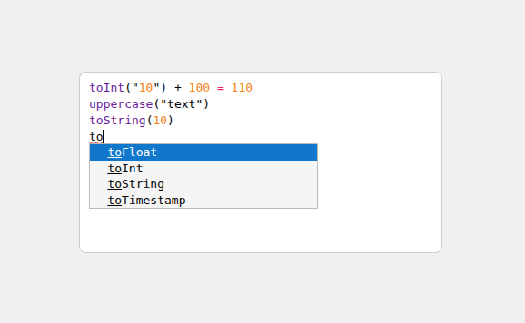

	
	 
	 
	<h1><strong>Projeto Atena - Editor DSL</strong></h1>

### Introdução
Repositório responsável por manter uma POC (Proof of Concept) de testes para criação de um editor de código utilizando uma gramática customizada (DSL).

### Objetivos
- [x] Definir uma gramática customizada
- [x] Utilizar a gramática utilizada para definir linter 
- [x] Utilizar a gramática utilizada para definir auto-complete 
- [x] Utilizar a gramática utilizada para definir syntax-highlight
- [x] Transformar gramática escrita em uma AST estruturada

### Resultado

### Pontos importantes ou Observações
- Documentação (Codemirror): https://codemirror.net/
- Documentação (Lezer): https://lezer.codemirror.net/

### Tecnologias utilizadas
- React
- Typescript
- CodeMirror
- Lezer  
